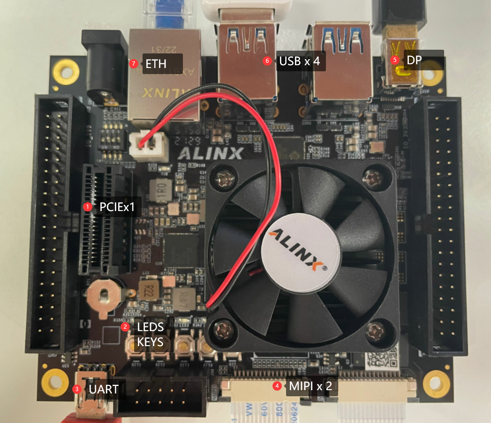
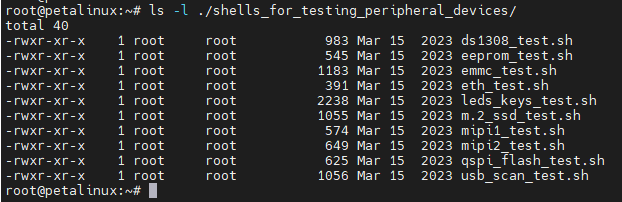
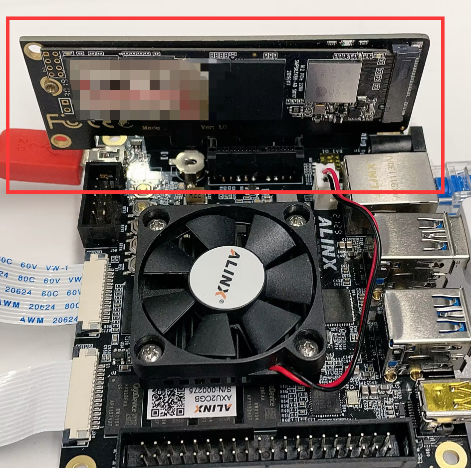

[Back to Home](../)
## Use the interfaces and peripherals on the development board in LINUX

---
- These interfaces and peripherals are available on the AXU2CGA and AXU2CGB development boards: 
\
①PCIEx1\
②LEDS、KEYS\
③UART\
④MIPI x 2\
⑤DP
⑥USB x 4\
⑦ETH\
⑧EMMC(图中不可见，仅AXU2CGB)\
⑨EEPROM(图中不可见)\
⑩QSPI FLASH(图中不可见)\
⑪DS1308(图中不可见)\
PS : In the Linux system on the development board made earlier, I integrated some shell scripts in path *~/shells_for_testing_peripheral_devices/*, which are used to test these interfaces and peripherals. You can also refer to these shell scripts to use these interfaces and peripherals:\


---
### ①PCIEx1
#### 1.1What is PCIex1
PCIe (Peripheral Component Interconnect Express) is a high-speed data transmission interface used to connect external devices and expansion cards on the motherboard. It is a serial interface. Compared with PCI interface, it has higher bandwidth and better scalability.\
PCIe slots are usually x1, x4, x8 or x16 in size, representing different bandwidth and transmission rates. The bandwidth of the PCIex1 bus interface is 250MB/s.\
PCIex1 can be used as an expansion card interface to add additional expansion cards, such as SSD controllers.
#### 1.2How to use PCIex1 in Linux
Take the SSD expansion card as an example, connect the SSD expansion card on the PCIex1 interface of the development board (please do not operate with power)：\
\
Then start the development board and log in to Linux. If  */dev/nvme0n1*  can be found, the SSD has been successfully identified.\
If the SSD has been partitioned, the device operation files corresponding to partitions like */dev/nvme0n1p1*, */dev/nvme0n1p2* can also be found.\
If the SSD does not have a partition or the file system format of the partition is not supported by the Linux system, you can use the **fdisk** tool to allocate the partition, use the **mkfs** command to make the file system, and use the mount command to mount it.\
For example, the following command will delete the first partition of */dev/nvme0n1*  and create a new partition, then format the partition into ext4 and mount it to */run/media/nvme0n1p1* :
```
#umount  partition
umount /dev/nvme0n1p1
#Delete a partition of/dev/nvme0n1 and create a new partition
echo "d

n
p
1


w
" | fdisk /dev/nvme0n1
#Format the partition /dev/nvme0n1p1 into ext4 format
echo "y

" | mkfs.ext4 /dev/nvme0n1p1
#mount /dev/nvme0n1p1 to /run/media/nvme0n1p1
mount /dev/nvme0n1p1 /run/media/nvme0n1p1
```
After mounting, you can operate on files in the mounted path, and these files will eventually be saved in the SSD.
#### 1.3Use the script built in the system to test the PCIex1 SSD expansion card
Run the  *m.2_ssd_test.sh*  script in  *~/shells_for_testing_peripheral_devices/* .\
\
The information will be printed differently according to the usage of your SSD, but as long as the PCIex1 interface and SSD expansion card are intact, \"*ssd read write OK* \" will be output.

---
---
- Visit [ALINX official website](https://www.alinx.com) for more information.
