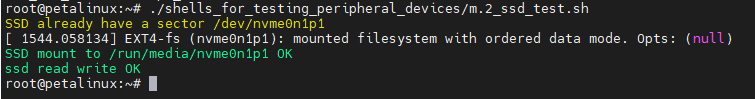
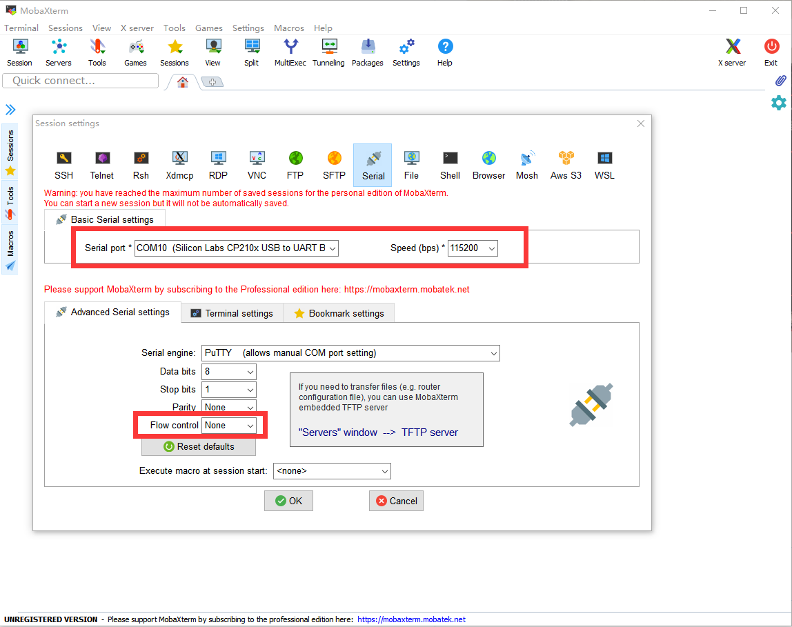
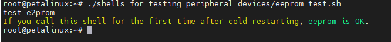

[Back to Home](../)
## Use the interfaces and peripherals on the development board in LINUX

---
- These interfaces and peripherals are available on the AXU2CGA and AXU2CGB development boards: 
\
①PCIEx1\
②LEDS、KEYS\
③UART\
④MIPI x 2\
⑤DP
⑥USB x 4\
⑦ETH\
⑧EMMC(图中不可见，仅AXU2CGB)\
⑨EEPROM(图中不可见)\
⑩QSPI FLASH(图中不可见)\
⑪DS1308(图中不可见)\
PS : In the Linux system on the development board made earlier, I integrated some shell scripts in path *~/shells_for_testing_peripheral_devices/*, which are used to test these interfaces and peripherals. You can also refer to these shell scripts to use these interfaces and peripherals:\


---
### ①PCIEx1
#### 1.1What is PCIex1
PCIe (Peripheral Component Interconnect Express) is a high-speed data transmission interface used to connect external devices and expansion cards on the motherboard. It is a serial interface. Compared with PCI interface, it has higher bandwidth and better scalability.\
PCIe slots are usually x1, x4, x8 or x16 in size, representing different bandwidth and transmission rates. The bandwidth of the PCIex1 bus interface is 250MB/s.\
PCIex1 can be used as an expansion card interface to add additional expansion cards, such as SSD controllers.
#### 1.2How to use PCIex1 in Linux
Take the SSD expansion card as an example, connect the SSD expansion card on the PCIex1 interface of the development board (please do not operate with power)：\
\
Then start the development board and log in to Linux. If  */dev/nvme0n1*  can be found, the SSD has been successfully identified.\
If the SSD has been partitioned, the device operation files corresponding to partitions like */dev/nvme0n1p1*, */dev/nvme0n1p2* can also be found.\
If the SSD does not have a partition or the file system format of the partition is not supported by the Linux system, you can use the **fdisk** tool to allocate the partition, use the **mkfs** command to make the file system, and use the mount command to mount it.\
For example, the following command will delete the first partition of */dev/nvme0n1*  and create a new partition, then format the partition into ext4 and mount it to */run/media/nvme0n1p1* :
```
#umount  partition
umount /dev/nvme0n1p1
#Delete a partition of/dev/nvme0n1 and create a new partition
echo "d

n
p
1


w
" | fdisk /dev/nvme0n1
#Format the partition /dev/nvme0n1p1 into ext4 format
echo "y

" | mkfs.ext4 /dev/nvme0n1p1
#mount /dev/nvme0n1p1 to /run/media/nvme0n1p1
mount /dev/nvme0n1p1 /run/media/nvme0n1p1
```
After mounting, you can operate on files in the mounted path, and these files will eventually be saved in the SSD.
#### 1.3Use the built-in script to test PCIex1 SSD expansion card
Run the  *m.2_ssd_test.sh*  script in  *~/shells_for_testing_peripheral_devices/* .\
\
The information will be printed differently according to the usage of your SSD, but as long as the PCIex1 interface and SSD expansion card are intact, \"*ssd read write OK* \" will be output.

---
### ②LEDS、KEYS
#### 2.1LEDs and KEYs on the development board
In addition to the RESET button, there are four groups of LEDs and KEY on the development board, all at the PL side. After power-on, the LEDs are all light by default:\

#### 2.2How to use LEDs and KEYs in Linux
Using LEDs and KEYs is actually configuring and using GPIO. In Linux, you only need to know the GPIO number to use the corresponding IO port. In our development version, the GPIO number of LED is from 504 to 507, and the GPIO number of KEY is from 508 to 511.\
The IO corresponding to LED needs to be configured as output. Taking LED1 as an example, the steps to use GPIO output are as follows :
```
#Export the corresponding port
echo 504 >> /sys/class/gpio/export
#Set this port as output
echo out >> /sys/class/gpio/gpio504/direction
#Make this port output high level to light LED
echo 1 >> /sys/class/gpio/gpio504/value
#Make this port output low level to turn off LED
echo 0 >> /sys/class/gpio/gpio504/value
```
The IO corresponding to KEY needs to be configured as output. Taking KEY1 as an example, the steps to use GPIO input are as follows :
```
#Export the corresponding port
echo 508 >> /sys/class/gpio/export
#Set this port as input
echo in >> /sys/class/gpio/gpio508/direction
#Read the current level state of this IO
cat /sys/class/gpio/gpio508/value
```

#### 2.3Use the built-in script to test LEDs and KEYs
运行 *~/shells_for_testing_peripheral_devices/* 中的 *leds_keys_test.sh* 脚本(*ps：按**ctrl+c**组合键退出该脚本。*)。然后可以用PS_KEY控制PS_LED点亮和熄灭，PL_KEY控制PS_LED点亮和熄灭
Run the  *~/shells_for_testing_peripheral_devices/*  script in  *leds_keys_test.sh*  (*ps: press **ctrl+c** to exit the script.*). Then you can use KEY to control the LED to turn on or off :\


---
### ③UART
#### 3.1What is UART
UART is a communication protocol, which is called "Universal Asynchronous Receiver/Transmitter". It is a serial communication protocol that can be used to transmit data between microcontrollers, sensors, computer peripheral devices, communication devices, etc.\
UART uses two signal lines for data transmission: one is the data line (TX), which is responsible for sending data; The other is the receiving line (RX), which is responsible for receiving data. UART communication uses asynchronous transmission mode, that is, the clock signals of both sides of the communication are not synchronized, and the start bit, stop bit and parity bit need to be added in the data transmission to ensure the correctness of the data.\
The main advantages of UART are simple, flexible and widely used. Because it is a general protocol that can communicate between different devices, it is widely used in embedded systems and communication fields.
#### 3.2How to use UART in Linux
UART is used as the default terminal window for Linux in our system. Connect UART to the PC (***The driver of CP210x needs to be installed on the PC**) :\
\
Open the corresponding COM with the serial port tool, set the baud rate to 115200, close the flow control, and click the OK button :\
\
After starting the development board, you can see the print information in the serial port tool :\
\
The device of UART in our Linux system is */dev/ttyPS0* . Data can be transferred through the UART interface by using the `echo "PS_UART test" > /dev/ttyPS0` command：\
\
You can see that the serial port has an echo, but the UART is used in the terminal, so it is not recommended to operate */dev/ttyPS0*.

---
### ④MIPI
#### 4.1What is MIPI
MIPI is the abbreviation of Mobile Industry Processor Interface. It is a series of interface standards developed by the MIPI Alliance, an organization created by some major mobile device manufacturers.\
MIPI is mainly committed to defining a series of hardware and software interface standards for mobile devices, including communication interfaces such as cameras, monitors and controllers, to help various parts of mobile devices exchange data and control signals more efficiently. MIPI protocol has the characteristics of high bandwidth, low power consumption, scalability, reliability and security, and is very suitable for modern mobile devices.\
In addition to mobile devices, the application of MIPI has also gradually expanded to other fields, such as automobiles, the Internet of Things, medical devices, etc., and has become one of the important interfaces for communication and control.\
The two MIPI interfaces in the current system of our development version are designed as inputs and can be connected to the MIPI camera.
#### 4.2How to use MIPI in Linux
First, we connect the monitor to the DP port and the OV5640 camera connected to the MIPI interface to the MIPI interface (please do not operate with power) :\
\
Take the MIPI1 interface as an example, use the command after the system is started and logged in :\
`media-ctl -p -d /dev/media0`\
If the node information under the device can be obtained successfully, it means that the i2c connection of the device ov5640 is normal.\
\
According to the above information, we can obtain the device node name as follows ：
```
ov5640 0-003c
80000000.mipi_csi2_rx_subsystem
80010000.v_proc_ss
```
Use the following command to set the camera to 1920x1080 and UYVY format ：
```
media-ctl -V '"ov5640 0-003c":0 [fmt:UYVY8_1X16/1920x1080@1/30 field:none]'
media-ctl -V '"80000000.mipi_csi2_rx_subsystem":0 [fmt:UYVY8_1X16/1920x1080 field:none]'
media-ctl -V '"80000000.mipi_csi2_rx_subsystem":1 [fmt:UYVY8_1X16/1920x1080 field:none]'
media-ctl -V '"80010000.v_proc_ss":0 [fmt:UYVY8_1X16/1920x1080 field:none]'
media-ctl -V '"80010000.v_proc_ss":1 [fmt:UYVY8_1X16/1920x1080 field:none]'
```
Then use the following command to display 1920x1080 camera image on the display :\
`gst-launch-1.0 -e v4l2src device=/dev/video0 ! video/x-raw,format=YUY2,width=1920,height=1080 ! kmssink bus-id=fd4a0000.zynqmp-display fullscreen-overlay=1`
#### 4.3Use the built-in script to test the MIPI
连接显示器到DP口，连接MIPI摄像头到MIPI口，运行 *~/shells_for_testing_peripheral_devices/* 中的 *mipi1_test.sh* 和*mipi2_test.sh*  脚本分别测试两个mipi接口(*ps：按**ctrl+c**组合键退出该脚本。*)以*mipi2_test.sh*  为例：\
Connect the display to the DP port, connect the MIPI camera to the MIPI port, run the *mipi1_test.sh* or *mipi2_test.sh* scripts in  *~/shells_for_testing_peripheral_devices/* to test the two mipi interfaces respectively (*ps: press **ctrl+c** to exit the script* ). Take *mipi2_test.sh* as an example :\
\
The camera image is displayed in the display :\


---
### ⑤DP
#### 5.1What is DP
DP (DisplayPort) interface is a digital video and audio interface standard used to connect computers, televisions, monitors, audio and other equipment. It is an open standard developed by Video Electronics Standards Association (VESA).\
There are two physical interfaces of DP interface, one is the standard DP interface in rectangular shape, and the other is the Mini DP interface in circular shape. The Mini DP interface is used on our development board.
#### 5.2Using DP in Linux
Connect DP to the display. After the system is started, you can see the Macthbox desktop :\


---
### ⑥USB x 4
#### 11.1What is USB
USB is the abbreviation of Universal Serial Bus. It is a universal data transmission standard used to connect computers or other devices with other devices, including printers, keyboards, mice, scanners, digital cameras, mobile devices and other external devices.\
With the continuous development of technology, the version of USB is also constantly updated. USB 1.0 is the earliest version and the transmission speed is very slow, but with the introduction of USB 2.0, the transmission speed has been significantly improved. USB 3.0 and USB 3.1 are faster versions, providing higher transmission speed and more power. At the same time, USB can also support different data transmission protocols, including HID (human interface device), audio, video and storage devices.\
There are four USB3.0 interfaces on our development board.
#### 11.2Using USB on Linux systems
In fact, common USB devices can be used directly on this system. For example, the mouse and keyboard can be used directly with the desktop. If you use the storage tools such as USB flash disk, you need to pay attention to the partition and file system format. You can refer to the partition and format method of SSD in **①PCIEx1**. After the USB flash disk is connected to the system, the device operation files are generally */dev/sda1*, */dev/sda2*, etc.
#### 11.3 script in Linux to test USB Drive
Connect a USB2.0 device (such as a mouse) and a USB3.0 device (such as a 3.0 USB flash drive) respectively, and use the *usb_scan_test.sh* script in *~/shells_for_testing_peripheral_devices/* to check whether the current four USB ports are intact, and check the connection of USB2.0 and USB3.0 devices.

---
### ⑦ETH
#### 7.1What is ETH
In the Linux operating system, \"ETH\" usually refers to the network interface device, which is the hardware device used to communicate between the computer and the network. In Linux, you can use the *ifconfig* command to manage and configure network interface devices. The development board and other network devices can be connected in the same network through the ETH interface for data transmission.\
In the Ethernet protocol, each device is assigned a unique MAC address for identification and communication in the network. When computers send data through network interface devices, they will be encapsulated in Ethernet frames and routed and transmitted using MAC addresses.
#### 7.2Using ETH in Linux
Connect ETH (such as through router or switch) to LAN :\
\
Then power on the development board, log in to the system, and use *ifconfig* to view the current ETH status :\
\
If your router or switch supports DHCP, both eth0 and eth1 will be automatically connected and be assigned an IP address.\
If no IP address is assigned, you need to use the following command to assign it manually, for example :\
`ifconfig eth0 192.168.8.67`\
The *ifconfig* command can also be used to set the subnet mask; If the MAC address needs to be modified, */etc/network/interfaces* needs to be modified; If you want to set the gateway, you need to use command **route**; If you need to modify DNS, you need to modify */etc/resolv.conf*. The relevant configuration will not be detailed, generally, as long as you connect to the LAN through the network cable, you can use eth0 directly after the system is powered on.\
#### 7.3Use the built-in script to set up and test ETH
Run the *eth_test.sh*  script in *~/shells_for_testing_peripheral_devices/*. This script can be followed by a parameter, that is, the address you want to ping. For example, here I ping www.baidu.com. If no parameter is added, the default is ping *www.google.com* :\
\
Finally, the result of the ping and the speed of the network interface link will be print.

---
### ⑧EMMC(AXU2CGB ONLY)
#### 8.1What is EMMC
EMMC (Embedded MultiMediaCard) is a storage device widely used by embedded devices. It integrates flash memory chip, controller, host interface and flash memory management software into a small package. With its small size, low power consumption and high cost performance, eMMC is a common choice in embedded device storage solutions.\
EMMC is mainly used in mobile devices (such as smart phones, tablets, digital cameras, etc.) and embedded devices in automotive, industrial control and other fields. It provides a high-speed and reliable storage solution, supports fast startup and data reading and writing, and can store operating system, application programs, media files and other data.\
An 8G EMMC is integrated on our development board.
#### 8.2Using EMMC on Linux
The operation file of EMMC in Linux system is */dev/mmcblk0*. The use method is similar to that of SSD in **⑧M.2** : set the partition, format the partition, and finally mount the partition. for example :
```
#Unmount partition
umount /dev/mmcblk0p1
#Delete a partition of /dev/mmcblk0 and create a new partition
echo "d

n
p
1


w
" | fdisk /dev/mmcblk0
#Format the /dev/mmcblk0p1 partition into ext4 format
echo "y

" | mkfs.ext4 /dev/mmcblk0p1
#mount /dev/mmcblk0p1 on /media/sd-mmcblk0p1
mount /dev/mmcblk0p1 /media/sd-mmcblk0p1
```
After mounting, you can operate on files in the mounted path, and these files will eventually be saved in EMMC.
#### 8.3Use the built-in script in Linux to test EMMC
Run the *emmc_test.sh* script in *~/shells_for_testing_peripheral_devices/*  :\


---
### ⑨EEPROM
#### 9.1What is EEPROM
EEPROM is a non-volatile memory (NVM), which is an improved version of the electrically erasable programmable read-only memory (EPROM). EEPROM can be erased and programmed by electronic signals.\
EEPROM is usually used to store a small amount of data, such as configuration information on the chip, product serial number, encryption key, etc. In some electronic devices, EEPROM can also be used to store user settings and personal data.\
Compared with flash memory, EEPROM has faster reading speed and higher durability, but smaller capacity. Compared with DRAM, EEPROM has longer data retention time, but slower write speed.
#### 9.2Using EEPROM on Linux
The operating file of eeprom in the system is */sys/bus/i2c/devices/1-0050/eeprom*.\
Use the following command to write data to eeprom :\
`echo -e "test e2prom\n" > /sys/bus/i2c/devices/1-0050/eeprom`\
Use the following command to view the contents of eeprom :\
`cat /sys/bus/i2c/devices/1-0050/eeprom`\

#### 9.3Use the built-in script in Linux to test EEPROM
Run the *eeprom_test.sh* script in *~/shells_for_testing_peripheral_devices/*  :\


---
### ⑩QSPI FLASH
#### 10.1What is QSPI FLASH
Flash is a kind of high-speed flash memory, which is often used in embedded systems and other applications to store program code, configuration data and other information.\
QSPI Flash is a flash chip based on SPI interface. It communicates through four parallel data lines (quad interfaces). Compared with traditional SPI Flash, it can achieve faster data transmission speed, usually up to tens of MHz. The capacity of QSPI Flash is usually between a few megabytes and tens of megabytes.\
QSPI Flash has many advantages, including fast read and write speed, low power consumption, erasability, easy integration and use, etc. In addition, it can be programmed and erased by software without any external equipment or signal line.
#### 10.2Using QSPI FLASH on Linux systems
In the current Linux system, QSPI FLASH is used to store the environment variables of u-boot. If you modify the environment variables of u-boot, you need to be careful when operating QSPI FLASH.
The operation file of QSPI FLASH in the system is */dev/mtd0*.
The FLASH device needs to be erased before writing. Use the following command to erase the first sector of QSPI FLASH :\
`flash_erase /dev/mtd0 0 1`\
*/dev/mtd0* is a block device. You can use the **dd** command to read or write files to */dev/mtd0*.\
Write the file to */dev/mtd0 with the following command* :
```
touch /home/root/.qspiflashwrite
echo "qspiflash test" > /home/root/.qspiflashwrite
dd of=/dev/mtd0 if=/home/root/.qspiflashwrite bs=4096 count=1
```
Use the following command to read data from */dev/mtd0* to a file :
```
touch /home/root/.qspiflashread
dd if=/dev/mtd0 of=/home/root/.qspiflashread  bs=4096 count=1
```
#### 10.3Use the built-in script in Linux to test QSPI FLASH
Run the *qspi_flash_test.sh* script in *~/shells_for_testing_peripheral_devices/*  :\


---
### ⑪DS1308
#### 11.1What is DS1308
DS1308 is a low-power real-time clock chip.
#### 11.2Using DS1308 on Linux systems
In our Linux system, the device operation file of DS1308 is */dev/rtc0*. You can use the **hwclock** command to read and write */dev/rtc0*. For example:
```
#Set the system time to "2023-03-01 10:30:00"
date --set="2023-03-01 10:30:00"
#Write the system time to/dev/rtc0
hwclock -f /dev/rtc0 -w
#Update the system time with the time in /dev/rtc0
hwclock -f /dev/rtc0 -r
```

#### 11.3Use the built-in script in Linux to test DS1308
Run the *ds1308_test.sh* script in *~/shells_for_testing_peripheral_devices/* :\


---
---
- Visit [ALINX official website](https://www.alinx.com) for more information.
